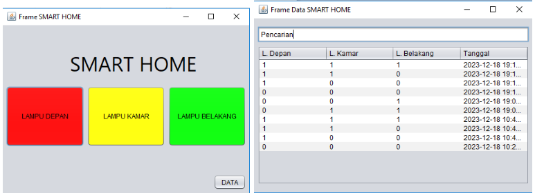

# JavaSmartHome
Smart Home with Java 
[Apache Netbeans](https://netbeans.apache.org/download/index.html) & [JConnector](https://mariadb.com/kb/en/about-mariadb-connector-j/)

- [Tabel Smart Home](https://gist.github.com/ahroihan/85e0f4240e36cc576413c300f5cc49dd)
- [Koneksi Smart Home](https://gist.github.com/ahroihan/777de9335b646ece932e112357ad95e2)
- [Data Smart Home](https://gist.github.com/ahroihan/6000830bff7bcfbbe25a94f9ece3b4bc)
- [Dashboard Smart Home](https://gist.github.com/ahroihan/3b029e331b6783b5d4a846e9b62bdf07)
- [Arduino and Php Files](https://gist.github.com/ahroihan/5c6ecf9b81eecd0c79b0dd2c0cdd5043#file-httpclient-arduinojson-ino)

